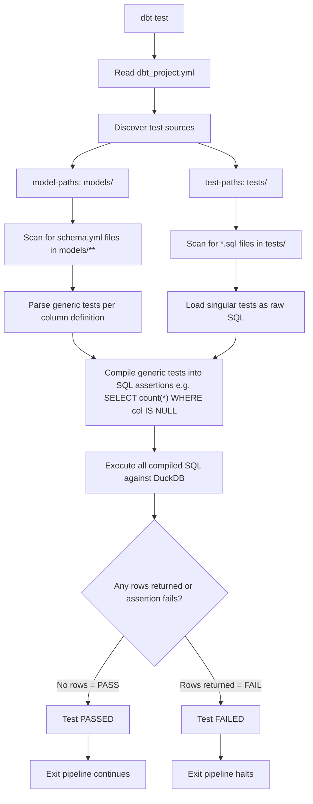

Welcome to your new dbt project!

### Using the starter project

Try running the following commands:
- dbt run
- dbt test

### Resources:
- Learn more about dbt [in the docs](https://docs.getdbt.com/docs/introduction)
- Check out [Discourse](https://discourse.getdbt.com/) for commonly asked questions and answers
- Join the [chat](https://community.getdbt.com/) on Slack for live discussions and support
- Find [dbt events](https://events.getdbt.com) near you
- Check out [the blog](https://blog.getdbt.com/) for the latest news on dbt's development and best practices

### Diagrams
Various architecture diagrams to help illustrate the workflow of the pipeline.

**Testing using dbt test**
The tests are performed at the project's startup (through `docker compose up`).
